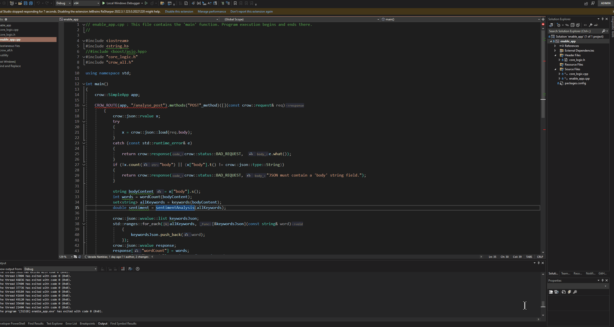

# enabl-app

A full-stack web application prototype using Next.js/React.js on the frontend, with C++ backend logic for advanced post analysis. The application demonstrates API integration, optimistic UI updates, SQL database usage, and secure endpoints, with optional ML and MLOps features.

---

## 🚀 Objective

- [x] Build a responsive, mobile-friendly web app to display, update, and create post data from a mock API ([jsonplaceholder.typicode.com/posts](https://jsonplaceholder.typicode.com/posts)).
- [x] C++ backend logic (e.g., word count, keyword extraction, sentiment analysis).
- [] Integrate the backend logic to frontend.
- [] Store and manage data using a SQL database.
- [] Secure API endpoints with API keys.
- [] Integrate ML models and MLOps workflows.

---

## ✨ Features

- **Frontend**
  -[] Next.js/React.js for a modern, responsive UI
  -[x] Paginated table of posts with edit and create functionality 
  -[x] Post details page with content.
  -[] Display content analysis.
  -[x] Modal for creating new posts
  -[] Styled with Tailwind CSS or Mantine

- **Backend**
  -[x] C++ core logic (e.g., analysis) 
  -[x] Expose the logic via REST API Crow tool
  -[] API built with Next.js API routes or Node.js
  -[]SQL database (PostgreSQL/MySQL) for storing posts, sessions, and logs
  -[] API key protection for secure endpoints

- **Optional Enhancements**
  -[] ML model integration (e.g., sentiment analysis) via Python FastAPI
  -[] MLOps workflow support (CI/CD with GitHub Actions, model tracking)

---

Note: 
This is a work in progress app right now. 
The backend and frontend are to be integrated, meanwhile here's a gif of how they individually work: 

